# Diary app - React Native


Welcome to our personal diary app, designed to help you keep track of your personal life. Our app is built using React Native and Expo, a popular open-source framework for building mobile applications using JavaScript and React.

Our app is designed to help you record your daily activities, thoughts, and experiences. With features like a journal, to-do list, our app makes it easy for you to stay organized and make the most of your time.

Our app is available for download on both iOS and Android devices, making it easy for you to access your personal diary anytime, anywhere. Whether you're on the go or at the office, our app makes it easy to record your daily activities and stay organized.

 our app is the perfect tool for anyone who wants to improve their personal health and well-being.


## Badges

[](https://choosealicense.com/licenses/mit/)


## Authors

- [@shabarishkera](https://www.github.com/shabarishkera)


## Installation

setup information
 

go to project directory and type `npm install`

this will  install the dependancy files
then run  

```bash
  expo start
```
  scan the QR code with your phone or press 'a' to directly open project with android studio
## Screenshots

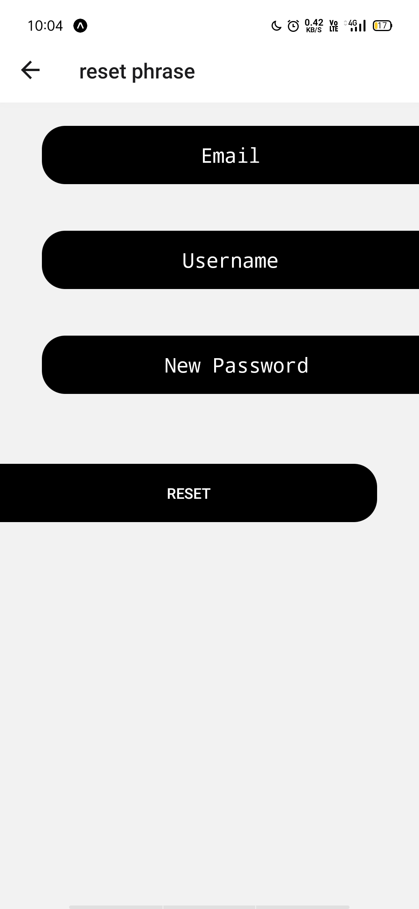<&nbsp;> 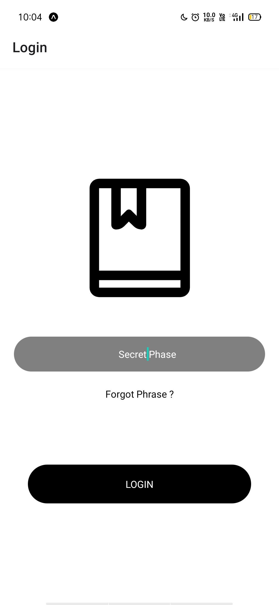
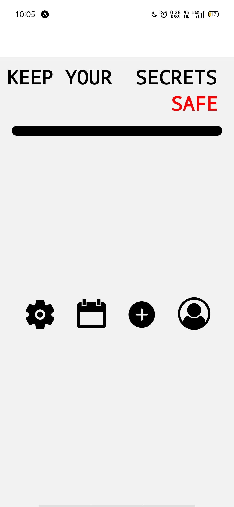<&nbsp;> 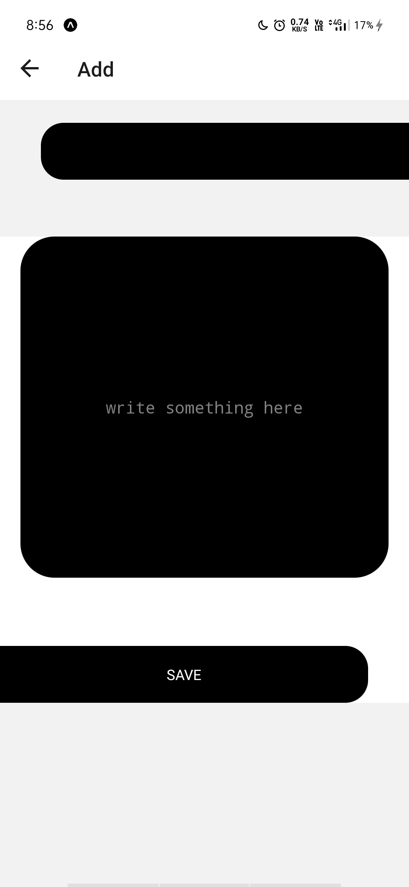
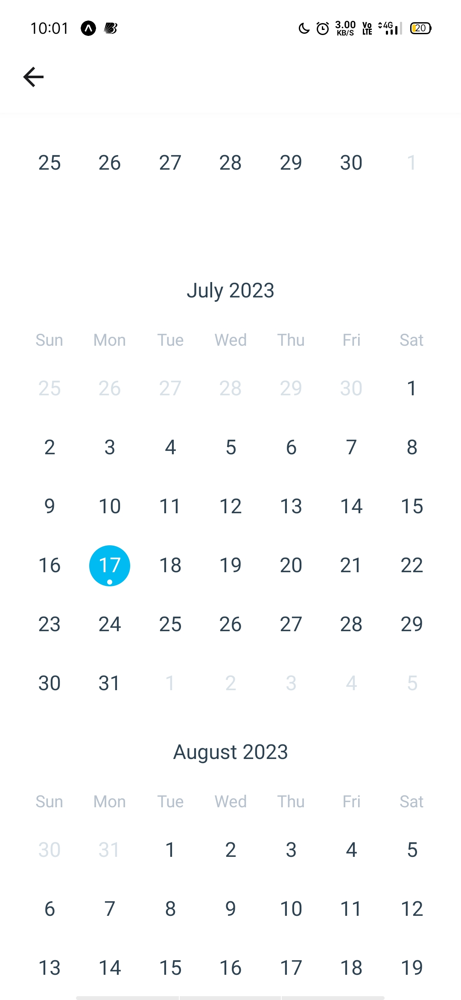<&nbsp;> 
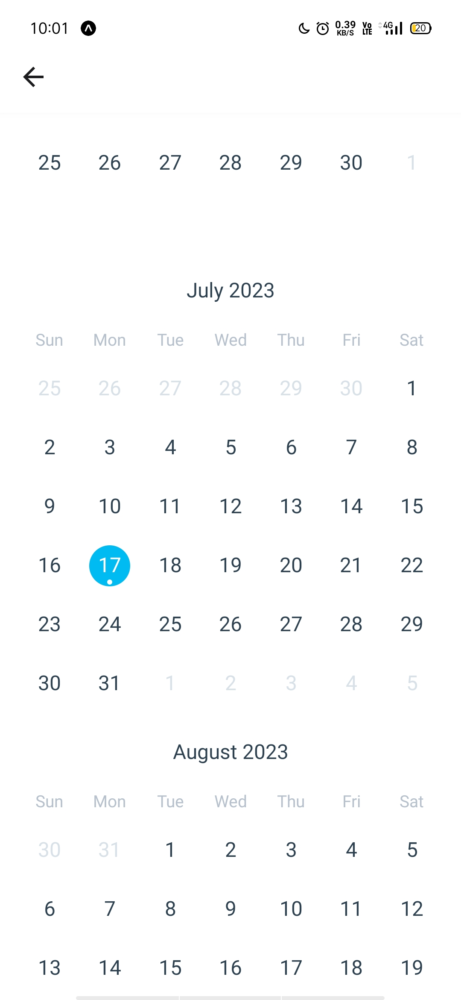
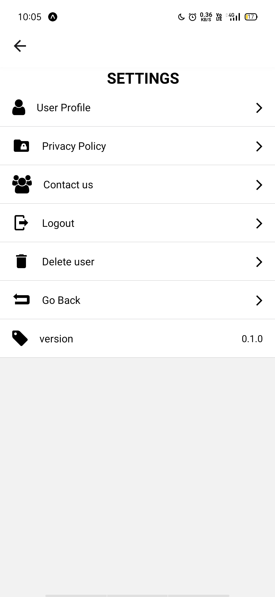<&nbsp;> 
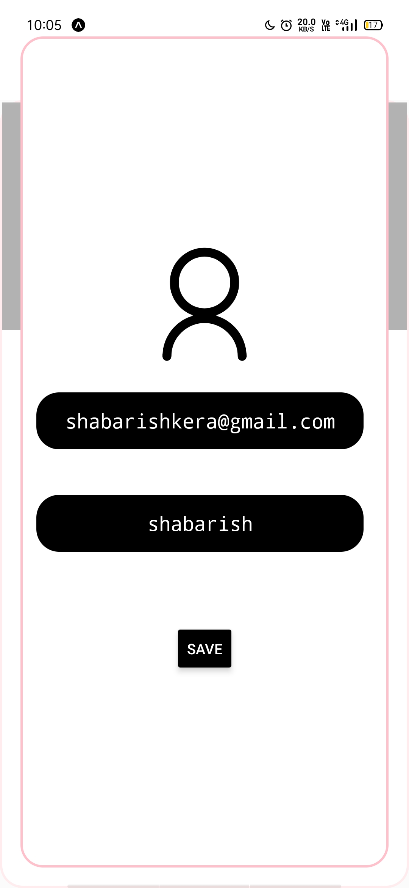
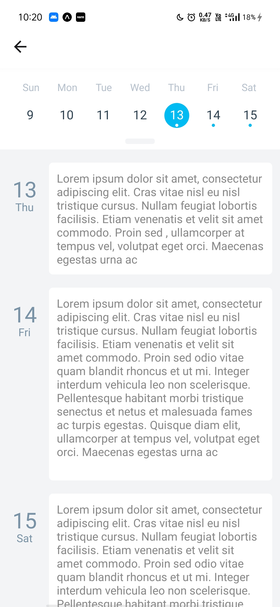<&nbsp;> 
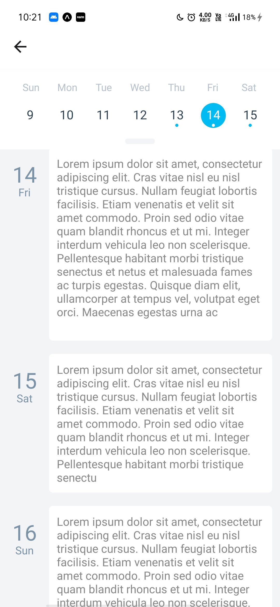
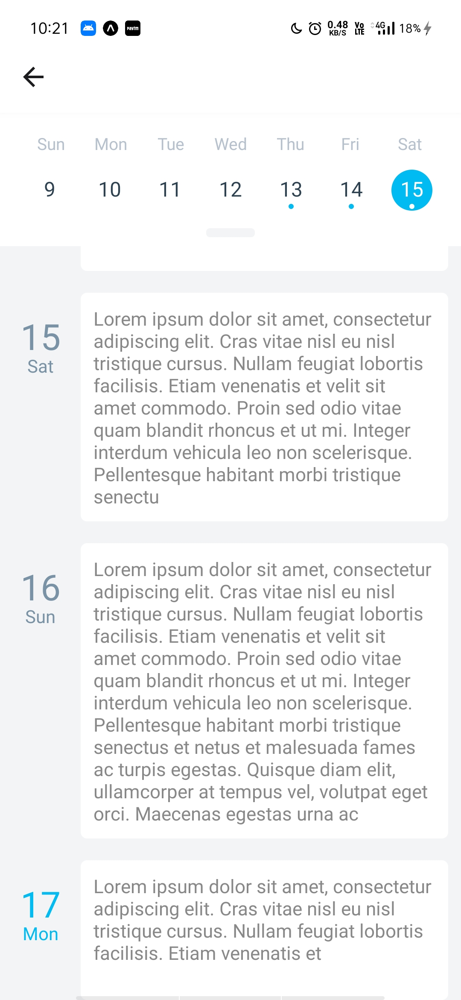
<&nbsp;> 
